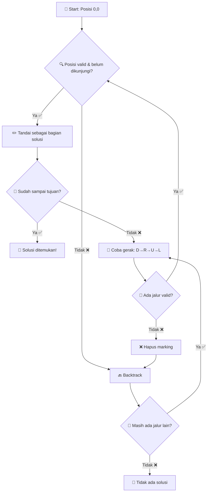

# 🐭 Rat in Maze Algorithm
## Backtracking & Pathfinding dalam C++

---

## 🎯 Definisi & Konsep Dasar

### 🐭 Apa itu Rat in Maze Algorithm?

**Rat in a Maze** adalah salah satu algoritma klasik dalam pemrograman yang menggunakan teknik **backtracking** untuk mencari jalur dari titik awal menuju tujuan dalam sebuah labirin.

### 🔧 Karakteristik Utama
- 🔄 **Metode:** Backtracking & Rekursi
- 🎯 **Tujuan:** Mencari semua kemungkinan jalur atau satu jalur yang valid
- 📊 **Struktur Data:** Matriks 2D
- 🚪 **Prinsip:** Trial and Error dengan systematic retreat

---

## 🌟 Mengapa Algoritma Ini Penting?

### 🔍 Masalah yang Diselesaikan
- ❓ **Bagaimana mencari jalan keluar dari labirin yang kompleks?**
- 🤖 **Bagaimana program bisa "berpikir" saat memilih dari banyak jalur?**
- 🧩 **Bagaimana menyelesaikan masalah dengan banyak kemungkinan solusi?**

### 🌍 Aplikasi di Dunia Nyata

| 🏷️ Bidang | 🎯 Aplikasi | 📝 Contoh |
|---|---|---|
| **🗺️ Navigasi** | GPS & Pemetaan | Mencari rute tercepat |
| **🎮 Gaming** | AI Pathfinding | Karakter NPC bergerak |
| **🤖 Robotika** | Motion Planning | Robot navigasi otomatis |
| **🧩 Puzzle Solving** | Logic Games | Sudoku, Maze Solver |
| **📡 Networking** | Route Finding | Network packet routing |

### 💡 Keunggulan Pembelajaran
- 🧠 **Melatih logika rekursif**
- 🔍 **Konsep dasar Depth-First Search (DFS)**
- 🎯 **Pemahaman algoritma pencarian**
- 🛠️ **Penerapan struktur data matriks**

---

## 🗺️ Representasi Maze

### 📊 Format Matriks
```
🟢 1 = Jalan (bisa dilewati)
🔴 0 = Dinding (tidak bisa dilewati)
```

### 📍 Contoh Maze 4×4
```
1 0 1 1
1 1 0 1
0 1 1 0
1 1 1 1
```

### 🧭 Notasi Gerakan
| Simbol | Arah | Koordinat |
|---|---|---|
| **R** | Right → | (row, col+1) |
| **L** | Left ← | (row, col-1) |
| **U** | Up ↑ | (row-1, col) |
| **D** | Down ↓ | (row+1, col) |

---

## 🔄 Algoritma Backtracking

### 🎯 Apa itu Backtracking?

**Backtracking** adalah metode algoritma yang mencoba semua kemungkinan solusi secara sistematis dan "mundur" ketika menemukan jalan buntu.

### 📋 Tiga Jenis Masalah Backtracking

| No | 🏷️ Jenis | 📝 Deskripsi | 🎯 Contoh |
|---|---|---|---|
| 1 | **Decision Problem** | Apakah solusi ada? | "Bisakah tikus mencapai tujuan?" |
| 2 | **Optimization Problem** | Solusi terbaik? | "Jalur tercepat/terpendek?" |
| 3 | **Enumeration Problem** | Semua solusi? | "Semua jalur yang mungkin?" |

---

## 🚀 Langkah-langkah Algoritma

### 📋 Algoritma Step-by-Step



### 🔢 Langkah Detail

1. **🏁 Inisialisasi**
   - Mulai dari posisi (0,0)
   - Siapkan matriks solution untuk tracking

2. **🔍 Validasi Posisi**
   ```cpp
   bool isValid(int x, int y) {
       return (x >= 0 && x < N && y >= 0 && y < N && 
               maze[x][y] == 1 && solution[x][y] == 0);
   }
   ```

3. **✏️ Marking**
   - Tandai posisi current: `solution[x][y] = 1`

4. **🎯 Base Case Check**
   - Jika sampai destination: return true

5. **🧭 Rekursif Movement**
   - Coba urutan: Down → Right → Up → Left
   - Untuk setiap arah yang valid, lakukan rekursi

6. **🔙 Backtracking**
   - Jika semua arah gagal: `solution[x][y] = 0`
   - Return false

---

## 💻 Contoh Implementation & Output

### 📊 Test Case: Maze 4×4
```
Input Maze:
1 0 1 1
1 1 0 1  
0 1 1 0
1 1 1 1
```

### 🎯 Expected Output
```
All Possible Paths from (0,0) to (3,3):

Path 1: DRDDRR
Solution Matrix:
1 0 0 0
1 1 0 0
0 1 0 0
0 1 1 1

Path 2: DRDRDR  
Solution Matrix:
1 0 0 0
1 1 0 0
0 1 1 0
0 0 1 1
```

### 📝 Penjelasan Output
- **Path String:** Urutan gerakan (D=Down, R=Right, U=Up, L=Left)
- **Solution Matrix:** Jalur yang dilewati (1) vs tidak dilewati (0)
- **Multiple Solutions:** Algoritma menemukan semua kemungkinan jalur

---

## 🧩 Soal Latihan: Tikus di Labirin

### 📋 Problem Statement
```
Maze 4×4 (1 = Jalan, 0 = Dinding):
1 1 1 0
0 1 1 1
1 1 0 1
0 0 1 1

🐭 Tikus: Start (0,0) → Goal (3,3)
🧭 Urutan gerakan: Down → Right → Up → Left
```

### ❓ **Pertanyaan Challenge:**
> **"Kotak mana yang pertama kali membuat tikus harus backtrack (tidak bisa melanjutkan ke kotak 1 yang belum dikunjungi)?"**

### 🔍 **Analisis Jalur:**
1. **(0,0)** ✅ → Start
2. **(0,1)** ✅ → Right dari start
3. **(0,2)** ✅ → Right lagi
4. **(1,2)** ✅ → Down
5. **(1,3)** ✅ → Right
6. **(2,3)** ✅ → Down
7. **(2,3)** ❌ → **STUCK!** No valid moves

**🎯 Jawaban:** Posisi **(2,3)** adalah titik pertama yang memaksa backtrack!

---

## ⚡ Analisis Kompleksitas

### 📊 Time & Space Complexity

| Aspek | 🔢 Kompleksitas | 📝 Penjelasan |
|---|---|---|
| **⏱️ Time** | O(4^(m×n)) | Worst case: 4 pilihan untuk setiap cell |
| **💾 Space** | O(m×n) | Recursion stack + solution matrix |
| **🔄 Recursion Depth** | O(m×n) | Maximum path length |

### 🎯 Optimasi Possible
- **🧭 Move Ordering:** Prioritas arah berdasarkan heuristic
- **✂️ Pruning:** Early termination untuk impossible paths
- **📝 Memoization:** Cache hasil untuk subproblems

---

### 🔧 Variasi Masalah

| 🏷️ Variasi | 📝 Deskripsi | 🎯 Aplikasi |
|---|---|---|
| **🎯 Single Solution** | Cari satu jalur saja | Quick pathfinding |
| **📊 All Solutions** | Cari semua jalur possible | Complete exploration |
| **⚡ Shortest Path** | Jalur dengan langkah minimum | Optimal routing |
| **🏆 Weighted Maze** | Cell punya cost berbeda | Cost optimization |
| **🚧 Dynamic Obstacles** | Obstacle berubah-ubah | Real-time navigation |

### 🛠️ Advanced Features
- **🔄 Multi-destination:** Beberapa target tujuan
- **🎯 Waypoints:** Harus lewati titik tertentu
- **⏰ Time constraints:** Batas waktu atau langkah
- **🎮 Interactive:** User input untuk real-time solving

---

## 🎯 Kesimpulan

### 📚 **Pembelajaran Utama**

**Rat in Maze Algorithm** mendemonstrasikan kekuatan **backtracking** dalam menyelesaikan masalah pencarian jalur yang kompleks. Melalui pendekatan rekursif dan systematic trial-and-error, algoritma ini mampu:

### ✅ **Keunggulan:**
- 🔍 **Eksplorasi Komprehensif:** Menjelajahi semua kemungkinan
- 🎯 **Fleksibilitas:** Dapat diadaptasi untuk berbagai variasi masalah
- 🧠 **Educational Value:** Melatih pemikiran rekursif dan problem-solving
- 🛠️ **Practical Application:** Dasar untuk algoritma pathfinding yang lebih complex

### 🎓 **Konsep yang Dipelajari:**
- **🔄 Backtracking Technique:** Systematic exploration dengan retreat capability
- **📊 Matrix Manipulation:** Penggunaan 2D array untuk representasi spatial
- **🧭 Recursive Problem Solving:** Pembagian masalah menjadi subproblems
- **✅ Validation Logic:** Pengecekan kondisi valid untuk setiap langkah

### 🚀 **Implementasi Praktis:**
Algoritma ini menjadi fondasi untuk:
- **🤖 AI Pathfinding:** Dalam robotics dan game development
- **🗺️ Route Planning:** Sistem navigasi dan GPS
- **🧩 Puzzle Solving:** Automated solving untuk logic games
- **📡 Network Routing:** Optimasi jalur data dalam networking

---