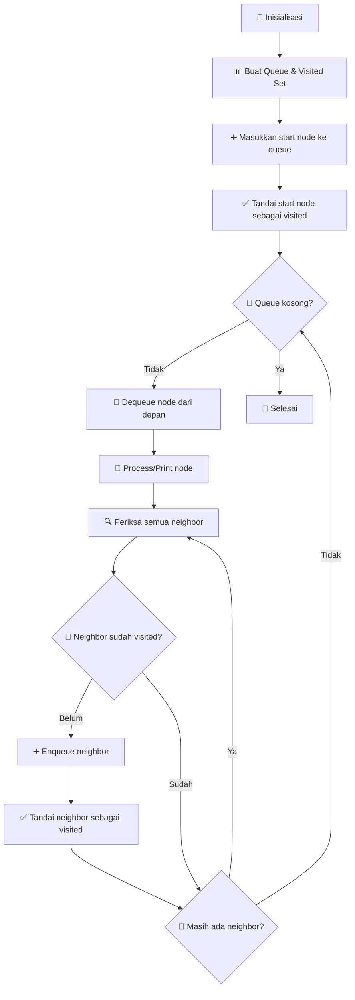

# 🌊 Breadth-First Search (BFS)
## Algorithm Pencarian Graf Level-by-Level

---

## 🎯 Pengertian BFS

### 🌊 Definisi
**Breadth-First Search (BFS)** adalah algoritma pencarian atau penelusuran graf yang bekerja dengan cara **menjelajahi semua simpul (node) yang berada pada level yang sama** terlebih dahulu, sebelum melanjutkan ke level berikutnya.

### 🔍 Konsep Dasar
> **"BFS menjelajahi graf secara melebar (dari pusat ke luar), bukan langsung masuk ke dalam cabang terdalam"**

### 🎯 Tujuan Utama BFS

| 🏷️ Tujuan | 📝 Deskripsi | 🎯 Aplikasi |
|---|---|---|
| **🗺️ Graf Traversal** | Menjelajahi seluruh simpul pada graf/pohon | Complete exploration |
| **⚡ Shortest Path** | Menemukan jalur terpendek pada graf tidak berbobot | GPS Navigation |
| **🔗 Component Detection** | Mendeteksi komponen yang terhubung dalam graf | Network Analysis |
| **🧱 Foundation Algorithm** | Digunakan sebagai dasar algoritma lanjutan | AI & Machine Learning |
| **⏰ Real-time Search** | Pencarian jalur optimal dalam sistem real-time | Game Development |

---

## 🧠 Dasar Teori BFS

### 🏗️ Prinsip Kerja

#### 📊 **Struktur Data Utama:**
- **🚪 Queue (Antrian)** → FIFO (First In, First Out)
- **✅ Visited Set** → Tracking simpul yang sudah dikunjungi
- **🗺️ Graph Representation** → Adjacency List/Matrix

#### 🔄 **Mekanisme Eksplorasi:**
```
Level 0: Start Node
Level 1: Direct neighbors of start
Level 2: Neighbors of Level 1 nodes
Level 3: Neighbors of Level 2 nodes
... dan seterusnya
```

### 🌊 Perbedaan BFS vs DFS

| Aspek | 🌊 BFS (Breadth-First) | 🌲 DFS (Depth-First) |
|---|---|---|
| **🎯 Strategi** | Eksplorasi level-by-level | Eksplorasi depth-first |
| **📊 Data Structure** | Queue (FIFO) | Stack (LIFO) |
| **🛣️ Path Finding** | Shortest path (unweighted) | Any path |
| **💾 Memory Usage** | Higher (stores all level nodes) | Lower (recursion stack) |
| **⚡ Time Complexity** | O(V + E) | O(V + E) |

---

## ⚡ Analisis Kompleksitas

### ⏱️ Kompleksitas Waktu: **O(V + E)**

#### 📊 Breakdown:
- **V = Jumlah simpul (vertices)**
- **E = Jumlah sisi (edges)**

#### 🔍 Penjelasan Detail:
- **Setiap simpul dikunjungi tepat satu kali** → O(V)
- **Setiap sisi diperiksa satu kali saat melihat tetangga** → O(E)
- **Total kompleksitas waktu** = O(V + E)

#### 💡 **Contoh Praktis:**
```
Graf dengan:
- 100 simpul (V = 100)
- 200 sisi (E = 200)
- Total operasi ≈ 300 operasi
```

### 💾 Kompleksitas Ruang: **O(V)**

#### 📊 Penggunaan Memori:
| 🏷️ Komponen | 💾 Space | 📝 Fungsi |
|---|---|---|
| **🚪 Queue** | O(V) | Menyimpan nodes yang menunggu |
| **✅ Visited Set** | O(V) | Tracking nodes yang sudah dikunjungi |
| **🗺️ Graph Storage** | O(V + E) | Representasi graf |

#### 🔍 **Worst Case Scenario:**
Pada level terbesar graf, queue bisa berisi semua nodes di level tersebut, menyebabkan penggunaan ruang **O(V)**.

---

## 🚀 Langkah-langkah BFS

### 📋 Algoritma Step-by-Step



### 🔢 Langkah Detail

1. **🏁 Inisialisasi**
   ```cpp
   queue<int> q;
   unordered_set<int> visited;
   ```

2. **📊 Setup Initial State**
   ```cpp
   q.push(startNode);
   visited.insert(startNode);
   ```

3. **🔄 Main Loop**
   ```cpp
   while (!q.empty()) {
       int current = q.front();
       q.pop();
       // Process current node
   }
   ```

4. **🔍 Neighbor Exploration**
   ```cpp
   for (int neighbor : graph[current]) {
       if (visited.find(neighbor) == visited.end()) {
           q.push(neighbor);
           visited.insert(neighbor);
       }
   }
   ```

---

## 📈 Contoh Pelacakan BFS

### 🗺️ Graf Example 1: Tree Structure

```
        A (Level 0)
       / | \
      B  C  D (Level 1)
     /|    |\
    E F    G H (Level 2)
```

#### 📊 Tabel Pelacakan:

| 🔢 Step | 📍 Current | 🚪 Queue Before | ➕ New Nodes | 🚪 Queue After | ✅ Visited |
|---|---|---|---|---|---|
| **Init** | - | - | A | [A] | {A} |
| **1** | A | [A] | B,C,D | [B,C,D] | {A,B,C,D} |
| **2** | B | [B,C,D] | E,F | [C,D,E,F] | {A,B,C,D,E,F} |
| **3** | C | [C,D,E,F] | - | [D,E,F] | {A,B,C,D,E,F} |
| **4** | D | [D,E,F] | G,H | [E,F,G,H] | {A,B,C,D,E,F,G,H} |
| **5** | E | [E,F,G,H] | - | [F,G,H] | {A,B,C,D,E,F,G,H} |
| **6** | F | [F,G,H] | - | [G,H] | {A,B,C,D,E,F,G,H} |
| **7** | G | [G,H] | - | [H] | {A,B,C,D,E,F,G,H} |
| **8** | H | [H] | - | [] | {A,B,C,D,E,F,G,H} |

**🎯 BFS Order:** A → B → C → D → E → F → G → H

---

### 🔢 Graf Example 2: Numbered Graph

```
    0 (Level 0)
   /|\
  1 2 3 (Level 1)
 /|   |\
4 5   6 7 (Level 2)
```

#### 📊 Tabel Pelacakan Detail:

| 🔢 Step | 📍 Current | 🚪 Queue Before | ➕ New Added | 🚪 Queue After | ✅ Visited |
|---|---|---|---|---|---|
| **Init** | - | [] | 0 | [0] | {0} |
| **1** | 0 | [0] | 1,2,3 | [1,2,3] | {0,1,2,3} |
| **2** | 1 | [1,2,3] | 4,5 | [2,3,4,5] | {0,1,2,3,4,5} |
| **3** | 2 | [2,3,4,5] | - | [3,4,5] | {0,1,2,3,4,5} |
| **4** | 3 | [3,4,5] | 6,7 | [4,5,6,7] | {0,1,2,3,4,5,6,7} |
| **5** | 4 | [4,5,6,7] | - | [5,6,7] | {0,1,2,3,4,5,6,7} |
| **6** | 5 | [5,6,7] | - | [6,7] | {0,1,2,3,4,5,6,7} |
| **7** | 6 | [6,7] | - | [7] | {0,1,2,3,4,5,6,7} |
| **8** | 7 | [7] | - | [] | {0,1,2,3,4,5,6,7} |

**🎯 BFS Traversal Order:** 0 → 1 → 2 → 3 → 4 → 5 → 6 → 7

---

## 💻 Implementasi C++

### 🛠️ Complete Implementation

```cpp
#include <iostream>
#include <queue>
#include <unordered_map>
#include <unordered_set>
#include <vector>

using namespace std;

class BFSTraversal {
private:
    unordered_map<char, vector<char>> graph;
    
public:
    // Add edge to graph
    void addEdge(char u, char v) {
        graph[u].push_back(v);
        graph[v].push_back(u); // For undirected graph
    }
    
    // BFS traversal function
    void BFS(char startNode) {
        queue<char> q;
        unordered_set<char> visited;
        
        // Initialize
        q.push(startNode);
        visited.insert(startNode);
        
        cout << "BFS Traversal: ";
        
        while (!q.empty()) {
            char current = q.front();
            q.pop();
            
            cout << current << " ";
            
            // Check all neighbors
            for (char neighbor : graph[current]) {
                if (visited.find(neighbor) == visited.end()) {
                    q.push(neighbor);
                    visited.insert(neighbor);
                }
            }
        }
        cout << endl;
    }
    
    // Display graph
    void displayGraph() {
        cout << "\nGraph Adjacency List:" << endl;
        for (auto& pair : graph) {
            cout << pair.first << " -> ";
            for (char neighbor : pair.second) {
                cout << neighbor << " ";
            }
            cout << endl;
        }
    }
};

int main() {
    BFSTraversal bfs;
    
    // Create example graph
    bfs.addEdge('A', 'B');
    bfs.addEdge('A', 'C');
    bfs.addEdge('B', 'D');
    bfs.addEdge('B', 'E');
    bfs.addEdge('C', 'F');
    
    bfs.displayGraph();
    
    // Perform BFS starting from 'A'
    bfs.BFS('A');
    
    return 0;
}
```

### 📊 Output Example
```
Graph Adjacency List:
A -> B C 
B -> A D E 
C -> A F 
D -> B 
E -> B 
F -> C 

BFS Traversal: A B C D E F
```

### 🔍 Penjelasan Kode

#### 🏗️ **Struktur Utama:**
- **`unordered_map<char, vector<char>> graph`** → Adjacency list representation
- **`queue<char> q`** → Queue untuk BFS traversal
- **`unordered_set<char> visited`** → Tracking visited nodes

#### 🔄 **Alur Eksekusi:**
1. **Inisialisasi:** Start node masuk ke queue dan visited set
2. **Main Loop:** Selama queue tidak kosong
3. **Dequeue:** Ambil node dari depan queue
4. **Process:** Print/process current node
5. **Explore:** Periksa semua neighbor yang belum visited
6. **Enqueue:** Masukkan unvisited neighbors ke queue

---

## 🎯 Aplikasi BFS dalam Dunia Nyata

### 🌍 Real-World Applications

| 🏷️ Domain | 🎯 Aplikasi | 📝 Contoh Konkret |
|---|---|---|
| **🗺️ Navigation** | Shortest Path Finding | GPS routing, Map applications |
| **🌐 Social Networks** | Friend Suggestions | Facebook "People You May Know" |
| **🎮 Game Development** | AI Pathfinding | NPC movement, Maze solving |
| **📡 Networking** | Broadcasting | Network packet routing |
| **🔍 Web Crawling** | Site Exploration | Search engine indexing |
| **🧩 Puzzle Solving** | State Space Search | Sliding puzzle, Rubik's cube |
| **🏢 Scheduling** | Task Dependencies | Project management |
| **🧬 Bioinformatics** | Gene Networks | Protein interaction analysis |

### 🚀 Advanced BFS Variants

#### 1. **🎯 Bidirectional BFS**
- Search from both start and end
- Meet in the middle approach
- Faster for large graphs

#### 2. **⚡ Multi-Source BFS**
- Start from multiple nodes simultaneously
- Useful for finding nearest facilities
- Applications in facility location problems

#### 3. **🏆 Weighted BFS (Dijkstra's)**
- Handle weighted graphs
- Find shortest path with weights
- Used in network routing protocols

---

## 🔄 Perbandingan dengan Algoritma Lain

### 📊 BFS vs Other Search Algorithms

| Algoritma | ⏱️ Time | 💾 Space | 🎯 Best Use Case | ✅ Guarantees |
|---|---|---|---|---|
| **🌊 BFS** | O(V+E) | O(V) | Shortest path (unweighted) | Optimal path |
| **🌲 DFS** | O(V+E) | O(V) | Graph connectivity | Complete exploration |
| **⚡ Dijkstra** | O(V²) | O(V) | Shortest path (weighted) | Optimal weighted path |
| **🌟 A*** | O(b^d) | O(b^d) | Heuristic search | Optimal with admissible heuristic |

### 🎯 Kapan Menggunakan BFS?

#### ✅ **Ideal Scenarios:**
- 🛣️ **Unweighted graphs** dengan equal edge costs
- 🎯 **Shortest path** requirement
- 🔍 **Level-by-level exploration** needed
- 📊 **Small to medium** sized graphs
- ⏰ **Real-time applications** dengan predictable performance

#### ❌ **Not Ideal When:**
- 🏋️ **Very large graphs** (memory intensive)
- ⚖️ **Weighted graphs** (use Dijkstra instead)
- 🌲 **Deep graphs** dengan narrow width
- 🎯 **Any path** is sufficient (DFS might be better)

---

## 💡 Tips & Best Practices

### 🛠️ Implementation Tips

#### ✅ **Do's:**
- **📊 Use appropriate data structures** (queue, set/map)
- **✅ Always mark nodes as visited** saat enqueue
- **🔍 Check visited status** sebelum enqueue
- **💾 Consider memory usage** untuk large graphs
- **🧪 Test with different graph types** (connected, disconnected)

#### ❌ **Don'ts:**
- **🚫 Don't mark visited** saat dequeue (akan menyebabkan duplikasi)
- **🚫 Don't forget** to handle disconnected components
- **🚫 Don't use** BFS untuk weighted shortest path
- **🚫 Don't ignore** memory constraints untuk large graphs

### 🎯 Optimization Techniques

#### 1. **📊 Memory Optimization:**
```cpp
// Use vector<bool> instead of unordered_set for dense node IDs
vector<bool> visited(maxNodes, false);
```

#### 2. **⚡ Performance Optimization:**
```cpp
// Reserve capacity for known graph sizes
queue<int> q;
q.reserve(expectedSize);
```

#### 3. **🔍 Early Termination:**
```cpp
// Stop when target is found
if (current == target) {
    return true; // Found target
}
```

---

## 🎓 Latihan & Soal

### 🧩 **Problem 1: Binary Tree Level Order**
```
Given a binary tree, return the level order traversal of its nodes' values.

Example:
Input: [3,9,20,null,null,15,7]
Output: [[3],[9,20],[15,7]]
```

### 🗺️ **Problem 2: Shortest Path in Grid**
```
Find shortest path in a binary grid from (0,0) to (n-1,m-1).
0 = walkable, 1 = obstacle

Example:
[[0,0,0],
 [1,1,0],
 [0,0,0]]
Output: 4 (minimum steps)
```

### 🔗 **Problem 3: Word Ladder**
```
Transform "hit" to "cog" using dictionary words,
changing one letter at a time.

Dictionary: ["hot","dot","dog","lot","log","cog"]
Output: 5 ("hit"->"hot"->"dot"->"dog"->"cog")
```

---

## 🎯 Kesimpulan

### 📚 **Key Takeaways**

**Breadth-First Search (BFS)** adalah algoritma fundamental dalam computer science yang memberikan solusi elegant untuk masalah pencarian graf dan pathfinding.

### ✅ **Keunggulan BFS:**
- 🎯 **Optimal Solution:** Garanteed shortest path untuk unweighted graphs
- 🔍 **Systematic Exploration:** Level-by-level traversal yang terstruktur
- 🌊 **Breadth Coverage:** Ideal untuk aplikasi yang membutuhkan complete coverage
- ⚡ **Predictable Performance:** Kompleksitas yang well-defined
- 🛠️ **Versatile Application:** Dapat diadaptasi untuk berbagai domain

### 🎓 **Pembelajaran Penting:**
- **📊 Data Structure Mastery:** Pemahaman queue dan graph representation
- **🔄 Algorithm Design:** Systematic approach dalam problem solving
- **⚡ Complexity Analysis:** Understanding time dan space trade-offs
- **🎯 Application Mapping:** Mengenali kapan BFS adalah solusi yang tepat

### 🚀 **Next Steps:**
- **🌟 Advanced Algorithms:** A*, Dijkstra, Bidirectional Search
- **🎮 Practical Projects:** Game AI, Navigation systems
- **📊 Graph Theory:** Deeper understanding of graph properties
- **💻 Implementation Practice:** Different programming languages dan optimizations

BFS bukan hanya algoritma, tetapi **foundation** untuk memahami graph algorithms yang lebih complex dan **gateway** menuju advanced topics dalam computer science! 🌟

---